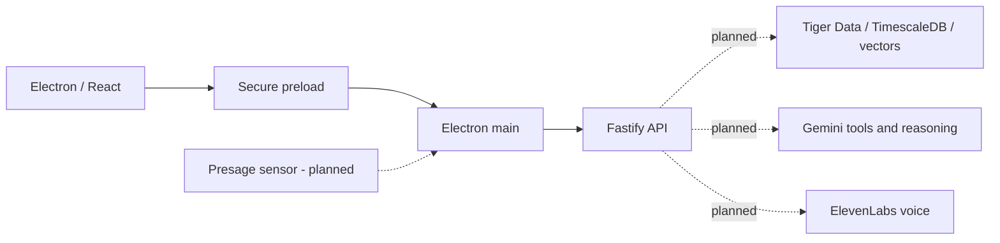

# TrueIris

Built for RowdyHacks XII. TrueIris is a personal context intelligence desktop application: physiological observations, computer activity, temporal history, and evidence-grounded conversation.

The master instructions live in [TRUEIRIS_SPEC.md](TRUEIRIS_SPEC.md). This initial milestone delivers a runnable application foundation and the [architecture](docs/ARCHITECTURE.md). Sensor, database, AI, and voice integrations are planned; the UI shows empty states rather than generated measurements or answers.

## Architecture



See [initial repo analysis](docs/REPO_ANALYSIS.md), [architecture and data model](docs/ARCHITECTURE.md), [feature roadmap](docs/IMPLEMENTATION_PLAN.md), and [privacy inventory](docs/PRIVACY.md).

## Requirements and setup

Use Node.js 24 LTS (or a newer compatible version), pnpm **12.8.1**, Git, and a desktop graphical session. Electron 44 requires macOS 13 or later on Mac. Tested on macOS Apple Silicon. Docker is not needed for the foundation; database and Vultr work will add it later.

```bash
npm install --global pnpm@12.8.1
pnpm install
cp .env.example .env
pnpm dev
```

`pnpm dev` starts Fastify on `127.0.0.1:3001` and Electron with React HMR. Configuration defaults work without `.env` or credentials. The root `.env` is loaded by main/backend processes even when launched through a workspace command. Never use a `VITE_` variable for a private key. Restart processes after changing environment variables. Electron 44 downloads its native binary on first use, so the first desktop launch needs network access and can take several minutes.

## Development commands

| Command                             | Behavior                                                                                              |
| ----------------------------------- | ----------------------------------------------------------------------------------------------------- |
| `pnpm dev`                          | Start API and desktop together; stop both if either exits                                             |
| `pnpm dev:desktop`                  | Start Electron only; API-unavailable state is supported                                               |
| `pnpm dev:api`                      | Start Fastify with watch mode                                                                         |
| `pnpm format` / `pnpm format:check` | Format source/docs or check formatting; preserve master spec                                          |
| `pnpm lint`                         | ESLint with zero warnings allowed                                                                     |
| `pnpm typecheck`                    | Strict TypeScript across all workspaces                                                               |
| `pnpm test`                         | Unit and in-process API tests                                                                         |
| `pnpm build`                        | Bundle desktop main/preload/renderer and API                                                          |
| `pnpm test:integration`             | Launch built API and Electron; check routes, bridge isolation, connection/failure states; build first |
| `pnpm check`                        | Format check, lint, type checking, unit tests, and builds                                             |
| `pnpm start:api`                    | Run the built API                                                                                     |
| `pnpm start:desktop`                | Run the built Electron application                                                                    |

For production-output verification, run `pnpm build`, then `pnpm start:api` and `pnpm start:desktop` in separate terminals. The build produces runnable bundles, not signed installers. Database migration and demo seeding commands will be added with their features.

`GET http://127.0.0.1:3001/health` reports API liveness and explicit unimplemented integrations. An API connection is not proof that sponsor services are connected. Stopping the API updates the desktop connection indicator automatically.

## Sponsor integration setup (next milestones)

| Technology           | Planned role                                        | Setup / current state                                                                                                                                                                                                               |
| -------------------- | --------------------------------------------------- | ----------------------------------------------------------------------------------------------------------------------------------------------------------------------------------------------------------------------------------- |
| Presage SmartSpectra | Native physiological perception                     | Obtain `PRESAGE_API_KEY`; verify subscription-enabled cardio/HRV metrics and platform runtime. [Official Node/Electron docs](https://smartspectra.presagetech.com/docs/nodejs/). Adapter and camera permissions are not active yet. |
| Tiger Data           | Temporal measurements, aggregates, semantic storage | Provision PostgreSQL with TimescaleDB and vector support; set `DATABASE_URL` with the provider's TLS requirements. [Tiger docs](https://www.tigerdata.com/docs). No migrations or connection yet.                                   |
| Gemini               | Explicit tool calls, grounded answers, embeddings   | Obtain `GEMINI_API_KEY` from Google AI Studio. [Function-calling docs](https://ai.google.dev/gemini-api/docs/function-calling). Model selection and agent arrive later.                                                             |
| ElevenLabs           | Realtime STT and streaming TTS                      | Set `ELEVENLABS_API_KEY` and `ELEVENLABS_VOICE_ID`. [Realtime token docs](https://elevenlabs.io/docs/eleven-api/guides/how-to/speech-to-text/realtime/client-side-streaming). Token issuance and audio streaming arrive later.      |
| Vultr                | Dockerized API orchestration                        | `VULTR_DEPLOYMENT_ENV` accepts local/staging/production. Remote deployment needs TLS, authentication, scoped queries, container configuration, and service checks; no deployment has occurred.                                      |

Keep API secrets in `.env` or runtime secret configuration. They are ignored by Git and never sent through the preload bridge. Setting a key does not activate an unimplemented integration.

## Demo and privacy

`TRUEIRIS_DEMO_MODE` defaults to `false`; it is strictly parsed. Setting it to `true` currently records the requested configuration only. Seeded history, sensor fallback, and presentation mode are future work. There is no simulated history in this milestone.

Camera sensing, desktop context, screenshots, and voice are inactive. The API binds to loopback by default. No observation is stored or sent to sponsor APIs. Future screen understanding requires explicit opt-in and transient image processing; all data sources must retain real/mock/seed provenance. See [privacy inventory](docs/PRIVACY.md).

## Troubleshooting

- **API unavailable:** run `pnpm dev:api`; check `/health`, the host/port, and `TRUEIRIS_API_URL`. The renderer remains usable without it.
- **Invalid environment fields:** check only the named fields against `.env.example`; demo mode must be `true` or `false`, the port must be 1–65535, and URLs must use the expected protocol. Error messages intentionally omit values.
- **Electron binary missing:** use the pinned pnpm version and run `pnpm --filter @trueiris/desktop exec install-electron`. `allowBuilds` permits Electron/esbuild scripts; do not globally enable all dependency scripts.
- **Electron runs as Node:** if an editor-hosted environment sets `ELECTRON_RUN_AS_NODE`, unset it before launching the desktop (`env -u ELECTRON_RUN_AS_NODE pnpm dev` on macOS/Linux). Integration tests remove it automatically.
- **Blank desktop:** inspect terminal lifecycle logs, run `pnpm check`, and confirm the preload and renderer bundles exist in `apps/desktop/out`. Dev uses port 5173 with strict conflict detection.
- **Linux CI without a display:** run integration tests with `xvfb-run --auto-servernum pnpm test:integration`. CI may need `ELECTRON_DISABLE_SANDBOX=1` only for the automated launch environment; desktop security preferences remain enabled.
- **No pulse/voice/history:** these integrations are not implemented in the foundation. Follow the roadmap rather than assuming missing credentials are the only issue.

## Feature workflow

For every completed feature: format, lint, typecheck, run relevant tests, build, inspect the diff, update documentation, commit, push, and verify `git status`. Do not commit credentials, raw captures, generated dependencies, or private user data. See sections 3 and 50 of the master brief.
