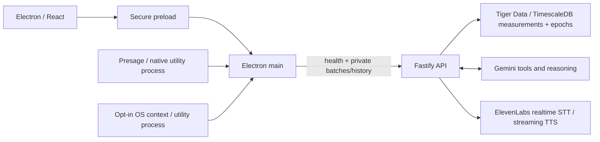

# TrueIris

Built for RowdyHacks XII. TrueIris is a personal context intelligence desktop application: physiological observations, computer activity, temporal history, and evidence-grounded conversation.

The master instructions live in [TRUEIRIS_SPEC.md](TRUEIRIS_SPEC.md). The foundation, Feature 2 sensor integration, Feature 3 live view, Feature 4 Tiger Data ingestion, Feature 5 Today timeline, Feature 6 desktop context, Feature 8 personal baselines, Feature 9 Gemini tool-calling, Feature 10 recent explanations, Feature 12 ElevenLabs voice, and Feature 16 event reconstruction are implemented: user-started Presage camera sensing, validated pulse/respiration/HRV/talking events, confidence gates, and an explicitly labeled mock provider. The live view adds per-metric confidence, responsive signal states, a sensing-session clock, and explicitly manual activity selection. Opt-in authenticated persistence adds bounded retries, duplicate protection, Timescale measurements, 30-second epochs, and export/delete controls. The Today timeline adds source-separated physiological trends, recorded manual activity, signal gaps, timezone handling, and point/period selection. Desktop context adds opt-in foreground application/switches, idle/session duration, optional window titles, manual activity override and focus state, persisted as independent intervals and shown alongside physiology. Personal baselines compare selected contextual readings with quality-filtered earlier activity or time-of-day history, with explicit evidence support and insufficient-history states. Ask Iris now queries scoped history through Gemini tools and shows cited evidence, with explicit mock reasoning for tests. A one-click or typed last-30-minute explanation retrieves metrics, context, personal baselines and earlier activity matches, with a highlighted timeline beside the narrative. User-started voice displays partial/final transcripts, reuses Gemini tools, streams spoken answers and supports interruption with text fallback. Timeline selections now offer a chronological, cited reconstruction from first-party recordings. See [event reconstruction](docs/EVENT_RECONSTRUCTION.md). Semantic memory remains planned. See [voice setup](docs/ELEVENLABS_VOICE.md). See the [architecture](docs/ARCHITECTURE.md).

## Architecture



See [desktop context and permissions](docs/DESKTOP_CONTEXT.md), [initial repo analysis](docs/REPO_ANALYSIS.md), [architecture and data model](docs/ARCHITECTURE.md), [feature roadmap](docs/IMPLEMENTATION_PLAN.md), [live view behavior](docs/LIVE_VIEW.md), [Today timeline](docs/TIMELINE.md), [personal baselines](docs/PERSONAL_BASELINES.md), [Gemini agent setup](docs/GEMINI_AGENT.md), [last-30-minute explanation](docs/RECENT_EXPLANATION.md), and [privacy inventory](docs/PRIVACY.md).

## Requirements and setup

Use Node.js 24 LTS (or a newer compatible version), pnpm **12.8.1**, Git, and a desktop graphical session. Electron 44 requires macOS 13 or later on Mac. Tested on macOS Apple Silicon. A managed Tiger Data service needs no local Docker. CI uses an isolated Timescale container; Vultr deployment remains planned.

```bash
npm install --global pnpm@12.8.1
pnpm install
cp .env.example .env
pnpm dev
```

`pnpm dev` starts Fastify on `127.0.0.1:3001` and Electron with React HMR. Configuration defaults work without `.env` or credentials. For live sensing, set `PRESAGE_API_KEY` in the ignored `.env`, restart, then choose **Start camera sensing** on Live. Camera capture never starts automatically. Read [Presage setup and verification](docs/PRESAGE_SETUP.md) for platform requirements, quality handling, mock scenarios, and native packaging.

The root `.env` is loaded by main/backend processes even when launched through a workspace command. Never use a `VITE_` variable for a private key. Restart processes after changing environment variables. Electron 44 downloads its native binary on first use, so the first desktop launch needs network access and can take several minutes.

## Development commands

| Command                             | Behavior                                                                                              |
| ----------------------------------- | ----------------------------------------------------------------------------------------------------- |
| `pnpm dev`                          | Start API and desktop together; stop both if either exits                                             |
| `pnpm dev:desktop`                  | Start Electron only; API-unavailable state is supported                                               |
| `pnpm dev:api`                      | Start Fastify with watch mode                                                                         |
| `pnpm format` / `pnpm format:check` | Format source/docs or check formatting; preserve master spec                                          |
| `pnpm lint`                         | ESLint with zero warnings allowed                                                                     |
| `pnpm typecheck`                    | Strict TypeScript across all workspaces                                                               |
| `pnpm test`                         | Unit and in-process API tests                                                                         |
| `pnpm build`                        | Bundle desktop main/preload/renderer and API                                                          |
| `pnpm test:integration`             | Launch built API and Electron; check routes, bridge isolation, connection/failure states; build first |
| `pnpm db:migrate`                   | Apply versioned Timescale schema explicitly                                                           |
| `pnpm test:database`                | Verify real Timescale SQL with isolated fixture owners                                                |
| `pnpm test:persistence`             | Verify built desktop → authenticated API → real database with a mock session                          |
| `pnpm test:gemini`                  | Explicit live Gemini checks against synthetic multi-step and recent-explanation fixtures              |
| `pnpm check`                        | Format check, lint, type checking, unit tests, and builds                                             |
| `pnpm start:api`                    | Run the built API                                                                                     |
| `pnpm start:desktop`                | Run the built Electron application                                                                    |

For production-output verification, run `pnpm build`, then `pnpm start:api` and `pnpm start:desktop` in separate terminals. The build produces runnable bundles, not signed installers. Run `pnpm db:migrate` explicitly before enabling storage. Demo seeding remains planned.

`GET http://127.0.0.1:3001/health` reports API liveness and verified database readiness; reasoning reports configuration availability and voice reports configuration availability. An API connection is not proof that sponsor services are connected. Stopping the API updates the desktop connection indicator automatically.

## Sponsor integration setup

| Technology           | Planned role                                        | Setup / current state                                                                                                                                                                                                                                                                     |
| -------------------- | --------------------------------------------------- | ----------------------------------------------------------------------------------------------------------------------------------------------------------------------------------------------------------------------------------------------------------------------------------------- |
| Presage SmartSpectra | Native physiological perception                     | Implemented with SDK 3.4.0 in a main-owned utility process. Set `PRESAGE_API_KEY`; metric availability depends on plan and signal. [Setup guide](docs/PRESAGE_SETUP.md).                                                                                                                  |
| Tiger Data           | Temporal measurements, aggregates, semantic storage | Implemented: set `DATABASE_URL` and private `TRUEIRIS_INGEST_TOKEN`, run `pnpm db:migrate`, then opt into saving. [Setup, TLS, controls and verification](docs/TIGER_DATA_SETUP.md). Vector storage remains planned.                                                                      |
| Gemini               | Explicit tool calls, grounded answers, embeddings   | Obtain `GEMINI_API_KEY` from Google AI Studio. [Function-calling docs](https://ai.google.dev/gemini-api/docs/function-calling). Implemented: set `GEMINI_API_KEY` and restart the API; `gemini-3.8-flash` is the default. [Agent setup](docs/GEMINI_AGENT.md). Embeddings remain planned. |
| ElevenLabs           | Realtime STT and streaming TTS                      | Set `ELEVENLABS_API_KEY` and `ELEVENLABS_VOICE_ID`. [Voice setup and controls](docs/ELEVENLABS_VOICE.md). Keys remain in the backend; authenticated streaming is implemented.                                                                                                             |
| Vultr                | Dockerized API orchestration                        | `VULTR_DEPLOYMENT_ENV` accepts local/staging/production. Remote deployment needs TLS, authentication, scoped queries, container configuration, and service checks; no deployment has occurred.                                                                                            |

Keep API secrets in `.env` or runtime secret configuration. They are ignored by Git and never sent through the preload bridge. Setting a key does not activate an unimplemented integration.

## Demo and privacy

`TRUEIRIS_DEMO_MODE` defaults to `false`; it is strictly parsed. Setting it to `true` currently records the requested configuration only. Seeded history, sensor fallback, and presentation mode are future work. The timeline can show saved mock recordings, but this milestone does not create seeded history.

Camera sensing requires an explicit start and operating-system permission. Its status and Stop control remain visible across routes. Frames stay in the native worker. Saving starts off on each launch. Enabling it in Settings persists labeled measurements, epochs and actively captured desktop context; Stop saving, export and delete controls are available. Presage automatically uploads derived vitals summaries to its insight service; optional diagnostic telemetry is disabled. This disclosure appears before camera start. Desktop context is separately user-started, with default-off optional titles, visible Stop, and independently recorded intervals when saving is on. Screenshots remain inactive. Microphone access requires Start voice in Ask Iris and stops before reasoning/speech; audio is transient in TrueIris and sent to ElevenLabs. The API binds to loopback and requires a scoped private token for observations/timeline/export/delete. Future screen understanding requires explicit opt-in and transient image processing; all data sources retain real/mock/seed provenance. See [privacy inventory](docs/PRIVACY.md).

## Troubleshooting

- **API unavailable:** run `pnpm dev:api`; check `/health`, the host/port, and `TRUEIRIS_API_URL`. The renderer remains usable without it.
- **Invalid environment fields:** check only the named fields against `.env.example`; demo mode must be `true` or `false`, the port must be 1–65535, and URLs must use the expected protocol. Error messages intentionally omit values.
- **Electron binary missing:** use the pinned pnpm version and run `pnpm --filter @trueiris/desktop exec install-electron`. `allowBuilds` permits Electron/esbuild/koffi/protobufjs scripts; do not globally enable all dependency scripts.
- **Electron runs as Node:** if an editor-hosted environment sets `ELECTRON_RUN_AS_NODE`, unset it before launching the desktop (`env -u ELECTRON_RUN_AS_NODE pnpm dev` on macOS/Linux). Integration tests remove it automatically.
- **Blank desktop:** inspect terminal lifecycle logs, run `pnpm check`, and confirm the preload and renderer bundles exist in `apps/desktop/out`. Dev uses port 5173 with strict conflict detection.
- **Linux CI without a display:** run integration tests with `xvfb-run --auto-servernum pnpm test:integration`. CI may need `ELECTRON_DISABLE_SANDBOX=1` only for the automated launch environment; desktop security preferences remain enabled.
- **No pulse:** check the visible sensor issue and [Presage troubleshooting](docs/PRESAGE_SETUP.md). Values are withheld when the signal is missing, unstable, low-confidence, or affected by motion/talking; mock sensing must be selected explicitly.
- **Desktop context unavailable:** app detection supports macOS, Windows and X11 with `xprop`; Wayland/headless sessions report unsupported. macOS window titles need a separate opt-in and Accessibility permission. See [context setup](docs/DESKTOP_CONTEXT.md).
- **No saved history:** check database readiness, migrations and the saving control in Settings. See [Tiger Data troubleshooting](docs/TIGER_DATA_SETUP.md). Choose the matching source and timezone in Timeline. See [timeline behavior](docs/TIMELINE.md). See [voice setup and text fallback](docs/ELEVENLABS_VOICE.md).

## Feature workflow

For every completed feature: format, lint, typecheck, run relevant tests, build, inspect the diff, update documentation, commit, push, and verify `git status`. Do not commit credentials, raw captures, generated dependencies, or private user data. See sections 3 and 50 of the master brief.
