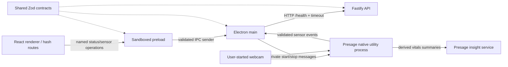
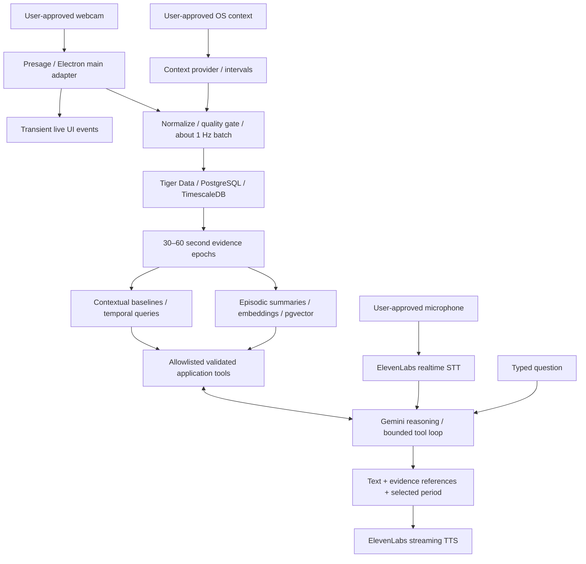

# TrueIris architecture

`TRUEIRIS_SPEC.md` is the project brief. This document records the chosen architecture and explicitly separates the running foundation, sensor integration, and live view from planned capabilities.

## Running foundation

The renderer has no Node integration and no API credentials. The preload bundles its dependencies into CommonJS because sandboxed Electron preloads cannot use a normal Node module loader. It exposes named status, sensor get/start/stop, and validated event subscription operations rather than generic IPC. Main rejects calls from other web contents and subframes. External navigation, new windows, webviews, and renderer permissions are denied. Main requests native camera permission only for a user-started Presage session. A local CSP limits renderer resources. Production uses local HTML and hash routing; development uses electron-vite HMR.

API configuration and secrets stay in the main/backend processes. Only validated, nonsecret status and normalized readings reach React. `/health` reports process liveness plus a verified Timescale migration/hypertable check; database is `ready` or `unavailable`, while reasoning reports configured availability and voice reports configured availability. Main verifies the response and reports `unavailable` after failed requests, invalid payloads, redirects, or a 2.5-second timeout. UI rechecks every five seconds without crashing when the API is stopped.

## Target evidence flow

Sensor events, opt-in authenticated persistence and pure 30-second epoch analytics are implemented. The Today timeline and optional recorded manual activity are implemented. Opt-in OS context and interval history are implemented in Feature 6. Personal activity/time-of-day baselines are implemented in Feature 8; the Gemini tool-calling agent is implemented in Feature 9; Feature 12 implements ElevenLabs voice; semantic memory remains planned.

## Workspace ownership

| Location                       | Responsibility                                                         | Allowed dependencies                        |
| ------------------------------ | ---------------------------------------------------------------------- | ------------------------------------------- |
| `apps/desktop/src/main`        | OS/camera lifecycle, private configuration, ingestion transport        | shared contracts; native adapters; API      |
| `apps/desktop/src/preload`     | Named IPC capabilities and validated event subscriptions               | browser-safe schemas and bridge types       |
| `apps/desktop/src/renderer`    | Design system, views, live presentation, evidence selection            | schemas/types, React; no Node or secrets    |
| `apps/api/src`                 | HTTP/WebSocket ingress, analytics orchestration, agents and tools      | shared, schemas; db/analytics when added    |
| `packages/schemas`             | Runtime validation at trust boundaries                                 | Zod only                                    |
| `packages/shared`              | Bridge/provider types, process-only configuration and logging subpaths | schemas, dotenv, Pino, Zod                  |
| `packages/db`                  | Parameterized SQL, scoped repositories, migration runner               | schemas, analytics; PostgreSQL client       |
| `packages/analytics`           | Pure epoch calculations; baselines deferred                            | schemas; no UI or SDK imports               |
| `packages/db/src/migration.ts` | Versioned PostgreSQL/Timescale SQL; vector deferred                    | executed only by explicit migration command |
| `docker` (planned)             | API image and Vultr deployment configuration                           | build output and runtime dependencies       |

Shared workspace packages export TypeScript source and are bundled into application output. Type checking runs independently for every workspace. Runtime third-party dependencies remain declared by the applications. New packages and directories are created when they have executable responsibilities; there are no empty placeholder services.

## Provider boundaries

Feature 2 implements `SensorProvider` with real Presage and explicit mock adapters. Feature 6 adds native and explicit mock `ContextProvider` adapters. Feature 9 adds `ReasoningProvider`; Feature 12 adds `VoiceProvider`; a later service adds `EmbeddingProvider` with deterministic mock implementations and failure tests. Adapters normalize vendor responses and hide vendor types from UI/analytics. Unsupported or unauthorized metrics stay absent; absence is never a zero measurement.

Native sensing runs in a main-owned utility process, keeping blocking native startup and raw frames outside main and renderer. Main owns a session/generation controller: concurrent starts are bounded, canceled permission requests cannot later start capture, late events are ignored, and failed teardown blocks replacement capture. Native stopAsync/destroy is awaited with a bounded kill fallback. Stop, document reload, renderer crash, window close, and quit release the worker; hash navigation preserves the session. React subscribes once across routes and shows a persistent status/Stop control.

The worker requests only pulse, breathing, HRV, and talking. It decodes protobuf packets, merges partial metrics by their own timestamps, and withholds unstable, stale, invalid, low-confidence, or talking-affected values. Confidence is normalized from vendor percentages to 0–1. No raw buffers, vendor error text, or keys reach renderer IPC. See [sensor setup](PRESAGE_SETUP.md) for thresholds and expiry.

Feature 3 separates live presentation into `renderer/src/live`. Signal issues take precedence over quality, and each available metric displays its own confidence. The validated snapshot includes a main-owned nullable `startedAt` UTC timestamp assigned on provider readiness; the renderer derives session duration from it, preserving time across routes. Stop/error clears it, and restarts assign a new timestamp. Manual activity is labeled user-selected and shared with main; Feature 5 stamps it on new measurements only while saving is enabled; foreground application remains explicitly off until Feature 6. Subtle accepted-signal animation respects reduced motion. See [live view behavior](LIVE_VIEW.md).

The API receives measurements only through the separately enabled saving pipeline. Optional SDK telemetry is disabled, but automatic Presage insight uploads send derived vitals summaries off-device. TrueIris does not request or display vendor-generated insights. The [privacy inventory](PRIVACY.md) documents this separate flow.

## Temporal data and provenance

All persisted timestamps use PostgreSQL `timestamptz` and UTC ISO strings at application boundaries. SmartSpectra 3.4 metric samples use absolute microsecond Unix timestamps, converted to milliseconds for freshness checks. Outgoing readings carry the current UTC observation time; each cached metric expires using its own vendor timestamp. Future relative-clock adapters must map a monotonic clock to a captured UTC session origin. Display timezone is an explicit user setting; date tools resolve local days into UTC ranges.

Three data rates remain separate: transient UI signal, roughly one persisted measurement per second, and 30–60 second reasoning epochs. Metric-specific confidence gates operate before aggregation. Epochs store sample counts, coverage/gaps, and per-metric valid counts; aggregate confidence cannot hide one missing metric. Context switches split intervals and either split epochs or record context composition. Do not average measurements across unrelated sessions or users.

Every observation and derived artifact carries source (`live`, `mock`, `demo_seed`), user/session identifiers, and evidence ranges. A mock stream never changes the source of genuine readings. Queries default to a selected dataset policy; baselines disclose whether seeded or mock history was included. Clearing seeded history targets only `demo_seed` rows and derived artifacts based on them.

Ingestion uses bounded batches, idempotent event identifiers, bounded retry with jitter, and visible connection status. A capped in-memory queue is the initial offline choice; overflow is reported as a gap, never silently turned into synthetic samples. Any later durable local queue requires explicit retention/deletion controls.

## Database model and future additions

| Table                 | Important columns / relationships                                                                             | Storage and indexes                                                                                   |
| --------------------- | ------------------------------------------------------------------------------------------------------------- | ----------------------------------------------------------------------------------------------------- |
| `users`, `sessions`   | UUIDs, timezone, session start/end, source                                                                    | Ordinary tables; enforce ownership                                                                    |
| `measurements`        | timestamp, event ID, user/session, pulse/respiration/HRV plus individual confidence, talking, quality, source | Hypertable by timestamp; unique `(timestamp, event_id)`; `(user_id, timestamp DESC)` and session/time |
| `context_events`      | ID, start/end, user/session, application, opt-in title, activity, semantic context, source, confidence        | Ordinary interval table; user/start and interval retrieval index                                      |
| `epochs`              | ID, start/end, user/session, means/variance, valid counts, coverage, quality, source, context ID              | Initially ordinary table; user/start, session/start, activity/user/start                              |
| `insights`            | ID, timestamp, user, type, description, evidence JSON, confidence, source                                     | Ordinary table; user/time/type                                                                        |
| `journal_entries`     | ID, timestamp, user, text, embedding, tags, source                                                            | Ordinary table; user/time plus vector index when dimension/model is chosen                            |
| `memories`            | ID, start/end, user, summary, embedding, metric/context metadata, evidence IDs, source                        | Ordinary table; user/start and vector similarity                                                      |
| `experiments`         | ID, user, source, title, hypothesis, immutable definition/criteria, status, created time                      | Ordinary table; owner/created time                                                                    |
| `experiment_sessions` | ID, owner/experiment/source, condition, start/end, metrics/support JSON, rating, notes                        | Ordinary table; owner/experiment/start; cascading foreign key                                         |

Use time-dimension columns in all hypertable unique constraints. Retain standard-table foreign keys for relational entities. Minute/15-minute/hourly/daily continuous aggregates are introduced only for demonstrated query needs, keeping metric counts and source separation. Activity summaries use epoch/context queries before introducing expensive materialization. Configure retention deliberately rather than enabling automatic loss of hackathon history.

Embedding model and vector dimension are chosen together during semantic memory work and versioned in records. Scope similarity searches by user and selected source policy before returning evidence. Avoid mixing embeddings from different models. Version 1 schema and ingestion checks are available through the explicit migration/verification commands.

## Agent and voice

Gemini chooses from allowlisted tools such as `get_current_state`, `get_metrics`, `get_context`, `compare_baseline`, `get_daily_summary`, `find_similar_sessions`, and `search_memories`. Zod validates inputs and outputs. Tools apply authenticated user scope, bounded time ranges/limits, and parameterized SQL. Never execute model-generated SQL. Each result includes evidence IDs, period, source, sample/coverage statistics, and uncertainty. Bound tool iterations, execution time, and response size; return useful partial evidence when a provider fails.

The response contract contains answer text, evidence cards, and a validated recent-explanation timeline range. It never exposes hidden reasoning. “Explain the last 30 minutes” composes temporal metrics, context, baseline comparisons, and similar sessions when available. Numerical claims must link to retrieved evidence; insufficient history is stated. No medical diagnoses or causal claims from correlations.

ElevenLabs STT and streaming TTS run entirely behind the authenticated API WebSocket. Main owns the private transport and microphone permission lease; narrow IPC carries bounded PCM frames and validated events. The renderer receives no vendor credential. Microphone opt-in, partial/final transcripts, explicit interruption and text fallback are implemented. See [voice architecture and limits](ELEVENLABS_VOICE.md). The Gemini loop remains the reasoning owner; do not substitute an opaque vendor conversational agent. Audio and screenshots are not persisted or logged by default.

## Deployment and authentication

Electron stays local. A future Dockerized Fastify API and workers run on Vultr, with Tiger Cloud as managed storage. Start with one API process and in-process epoch/session jobs; add a separate worker only when reliability or workload requires it. TLS terminates at Caddy/Nginx. Secrets enter via runtime environment. Container health checks use process liveness; a separate readiness endpoint will reflect actual required dependencies.

The current API binds to loopback, exposes non-sensitive health, and authenticates storage routes with one private token bound to one server-owned user identity. **Remote observation/query/token endpoints require authentication, per-user authorization, rate limits, TLS, and bounded payloads before deployment.** Ingestion/export/delete routes are scoped, bounded and rate-limited; public deployment and multi-user identity remain deferred. Database credentials never belong in the desktop renderer, and provider secret presence never proves provider health.

## Privacy and observability

See [privacy inventory](PRIVACY.md). Logs use structured event names and avoid arbitrary payloads, environment dumps, titles, prompts, journal text, raw media, and audio. Pino redacts known credential fields as an additional guard. Runtime status distinguishes unimplemented, unavailable, and ready integrations. Screen understanding stays deferred and visibly opt-in; capture cadence and retention need implementation before activation.

## Decisions and risks

1. Electron/React/Vite + Fastify follows the brief and keeps TypeScript across the stack. No prior architecture existed.
2. A pnpm workspace keeps schemas and application code together without adding a task orchestrator or unnecessary service infrastructure.
3. Hash routing supports Electron local files without a routing server.
4. Genuine pulse was verified in the built UI on macOS Apple Silicon with SDK 3.4.0. Accepted respiration and talking-state transitions were also verified; valid live HRV remains unverified. Other supported native platforms and signed installers still need hardware verification.
5. Tiger Cloud extension availability, vector model/dimension, context permissions across operating systems, remote authentication, and voice latency need separate acceptance checks.
6. Bundled production output is runnable; installer/signing/notarization is later packaging work and has not been claimed complete.

## References

- [Electron security checklist](https://www.electronjs.org/docs/latest/tutorial/security)
- [Electron context isolation](https://www.electronjs.org/docs/latest/tutorial/context-isolation)
- [SmartSpectra Node SDK and packaging](https://smartspectra.presagetech.com/docs/nodejs/)
- [SmartSpectra metrics](https://smartspectra.presagetech.com/docs/nodejs/metrics)
- [TimescaleDB hypertable constraints](https://docs.tigerdata.com/timescaledb/latest/overview/limitations/)
- [Tiger Data documentation](https://www.tigerdata.com/docs)
- [Gemini function calling](https://ai.google.dev/gemini-api/docs/function-calling)
- [ElevenLabs server realtime STT](https://elevenlabs.io/docs/eleven-api/guides/how-to/speech-to-text/realtime/server-side-streaming)

## Feature 4 persistence

The main-owned bounded queue receives validated sensor snapshots, preserves provenance and serializes one canonical UTC observation per second. Saving is off until the user enables it in Settings. A stable event UUID survives retries; overflow and bounded retry exhaustion are visible. The worker and renderer do not receive the API token or database credentials.

Authenticated API batches insert measurements and recalculate touched 30-second epochs in one user-serialized transaction. Session ownership/source/origin are immutable. Hypertable uniqueness includes time; a separate session-second constraint avoids render-rate duplicates. Epochs preserve per-metric counts, missing values, coverage and variance, and never combine sessions or datasets. User-row locking also serializes deletion; its retained watermark blocks late replay. Export streams paginated observations through a native save dialog. See [Tiger Data implementation and setup](TIGER_DATA_SETUP.md) for SQL, health, TLS, queue limits and tests.

## Feature 5 timeline

A named validated history IPC capability connects the renderer timeline to private main transport and authenticated `GET /timeline`. The API binds reads to its configured owner/source and the database uses a read-only repeatable-read transaction. Per-session 30-second means/min–max trends remain separate from exact activity changes and signal gaps; selected periods query raw observations again for correctly weighted statistics. Explicit timezone calendar boundaries handle DST. Display caps are disclosed and exact summaries remain available; missing data never becomes zero. Migration 2 adds nullable measurement activity and a scoped time index. Recorded manual choice is metadata on opted-in observations, with OS classification and interval storage deferred to Feature 6. See [Today timeline design and validation](TIMELINE.md).

## Feature 6 context intervals

Desktop context runs independently in an isolated utility process and is off on launch. Main owns its lifecycle, app/switch/idle/session state, title/focus opt-ins and manual activity override. Capture stops on lock, sleep, reload, renderer crash, close and quit. The classifier is pure and conservative; missing app evidence stays absent. No DOM or screen content is read.

Migration 3 adds context sessions and immutable intervals with owner/source/origin checks and 30-second maximum bounds. The authenticated API supplies owner identity, rejects overlap/changed payloads, and shares the ingestion/deletion transaction lock and replay watermark. A bounded in-memory context queue reuses measurement transport without converting context into sensor readings. Timeline returns separately clipped context in its read snapshot, including context-only periods. Temporal owner/source/overlap connects context to physiology; scalar epoch context IDs remain nullable rather than flattening multiple contexts. Export and delete cover both histories. See [desktop context](DESKTOP_CONTEXT.md) for permissions, platform coverage and verification.

## Feature 8 personal baselines

A named validated desktop capability and authenticated scoped comparison endpoint query raw history for contextual personal references. Quality-filtered 30-second per-session bucket means need sufficient samples across multiple local dates; current periods are excluded from historical evidence. Pure analytics calculate signed differences, percentages, standardized deviation and an explicit evidence-support heuristic. Results are transient, source separated, timezone aware and do not interpret physiological values medically. No new table or capture is added. See [personal baselines](PERSONAL_BASELINES.md) for method, contracts and validation.

## Feature 9 Gemini tools

A backend `ReasoningProvider` adapter uses the official Gemini API and an explicit deterministic mock. An allowlisted Zod tool registry projects bounded, scoped summaries over timeline, baseline and historical session services. The model chooses retrieval steps and cited facts; final prose is assembled from validated evidence templates. A named private desktop capability supplies a projection of current state and supports cancellation; Ask Iris renders provider/source labels, linked evidence and partial/failure states. Questions, transcripts and answers are transient; titles, frames and credentials never enter prompts. No schema migration is needed. See [agent contracts, setup, limits and verification](GEMINI_AGENT.md).

## Feature 10 recent explanation

The canonical text command and one-click Ask Iris action share the existing authenticated agent route and named IPC. A strict response carries its exact 30-minute source window, derived from the server request time. Gemini chooses required metrics/context/baseline/history calls and cited narrative facts; a bounded completion gate rejects missing categories, unrelated periods and guessed reference contexts. Request-local timeline/baseline caches keep the facts consistent without persistent storage. Pulse epoch comparisons are descriptive, qualify gaps and stop at session boundaries. An inline instance of the existing timeline chart loads the same window once and highlights it beside the narrative. No new capture, permission, migration or voice operation is added. See [recent explanation](RECENT_EXPLANATION.md).

## Feature 16 selected event reconstruction

A narrow reconstruction IPC operation projects a fixed question and source-bound selection into the existing Gemini agent. Its allowlisted tool reconstructs chronological first-party context, epoch, baseline and gap events. Gemini selects existing cited facts; the server verifies every answer sentence and pins the response range. Timeline reuses the shared agent-answer view. No new capture, persistent cache, database migration or provider is introduced. See [event reconstruction](EVENT_RECONSTRUCTION.md).

## Feature 17 personal experiments

Migration 4 adds owner/source-scoped experiment definitions and labeled sessions, with cascading deletion. The authenticated action route applies strict shared contracts and pure descriptive analytics; the server computes physiological metrics from accepted matching activity/source history and earlier baselines. Owner-row locks serialize mutations with ingestion/deletion, and evidence queries reuse the held transaction connection. Immutable criteria and snapshots preserve what was tested; missing evidence stays null. Named main/preload capabilities provide bounded transport and atomic native JSON export. The explicit in-memory adapter is test-only; no provider or sensing flow is invoked. See [personal experiments](PERSONAL_EXPERIMENTS.md) for eligibility and descriptive comparison rules.

## Feature 19 demo data

Migration 5 stores a `demo_seed` manifest under the dedicated demo identity. A deterministic generator validates measurements/context and uses production epoch analytics. Parameterized bulk insertion and existing baseline queries run in one owner-locked transaction. Source/owner-bound refresh/clear protect real captures and unrelated records. The manifest contains evidence-linked illustrative patterns, authored episode summaries and prepared experiment IDs. Demo-only keyword summary retrieval is distinct from deferred semantic embeddings. See [demo data](DEMO_DATA.md).

## Feature 20 dedicated presentation

The explicit demo launcher sets the mode for API and desktop. API token scope switches to the separate demo owner and a single-flight preparation service seeds once on startup; named bounded capabilities fetch/prepare its manifest. Private HTTP/WebSocket mode assertions reject mixed deployments. Presentation routes default to generated history/UTC and use evidence-linked sample artifacts; detailed health/provider controls live in Settings. Sensor lifecycle guards tear down failed real streams before any demo-only mock replacement and preserve source/session identity. No provider/database fallback is added outside the explicit mode. See [demo mode](DEMO_MODE.md).

## Iris companion redesign

The root route hosts a CSS-native animated companion and six symmetrical navigation blobs. A custom control slot reuses the existing voice lifecycle and user-gesture audio startup. Shared conversation state handles typed requests, cancellation and stale answers across home/Ask Iris. Optional home context recording uses existing validated context/storage capabilities with explicit saving and startup cancellation guards. Capture status remains global; source identity and backend architecture are unchanged. See [Iris interface](IRIS_INTERFACE.md).
