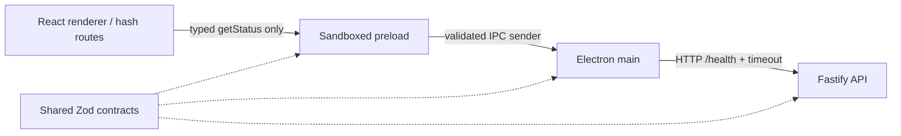
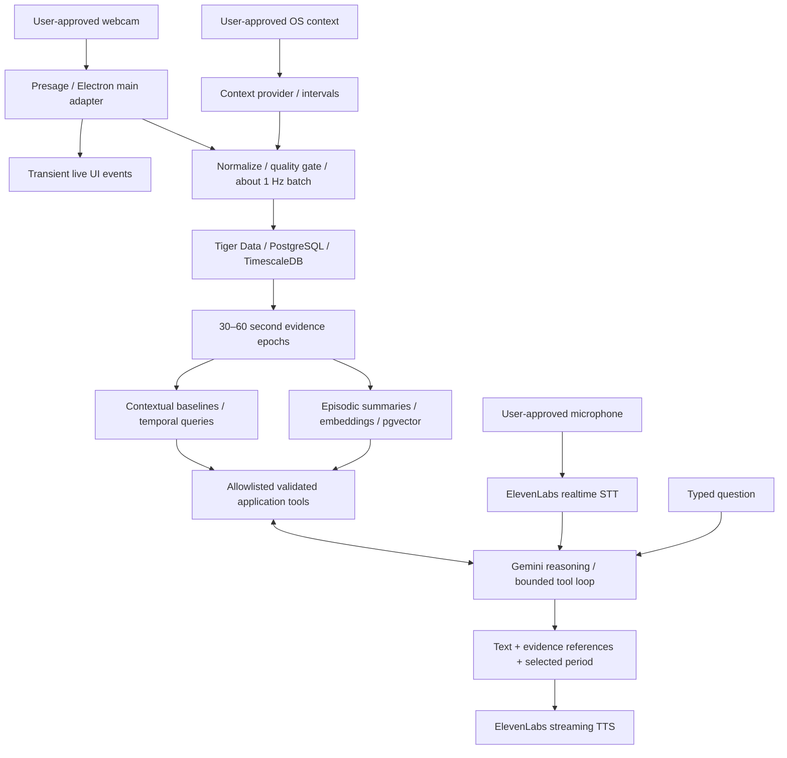

# TrueIris architecture

`TRUEIRIS_SPEC.md` is the project brief. This document records the chosen architecture and explicitly separates the running foundation from planned capabilities.

## Running foundation

The renderer has no Node integration and no API credentials. The preload bundles its dependencies into CommonJS because sandboxed Electron preloads cannot use a normal Node module loader. It exposes one named operation rather than generic IPC. Main rejects calls from other web contents and subframes. Navigation, new windows, webviews, and permissions are denied. A local CSP limits renderer resources. Production uses local HTML and hash routing; development uses electron-vite HMR.

API configuration and secrets stay in the main/backend processes. Only a validated, nonsecret status reaches React. `/health` reports process liveness, not database or sponsor availability; those dependencies explicitly report `not_implemented`. Main verifies the response and reports `unavailable` after failed requests, invalid payloads, redirects, or a 2.5-second timeout. UI rechecks every five seconds without crashing when the API is stopped.

## Target evidence flow

These sensing, persistence, analytics, memory, agent, and voice nodes are planned, not implemented by the foundation.

## Workspace ownership

| Location                       | Responsibility                                                         | Allowed dependencies                        |
| ------------------------------ | ---------------------------------------------------------------------- | ------------------------------------------- |
| `apps/desktop/src/main`        | OS/camera lifecycle, private configuration, ingestion transport        | shared contracts; native adapters; API      |
| `apps/desktop/src/preload`     | Named IPC capabilities; event subscriptions later                      | browser-safe schemas and bridge types       |
| `apps/desktop/src/renderer`    | Design system, views, live presentation, evidence selection            | schemas/types, React; no Node or secrets    |
| `apps/api/src`                 | HTTP/WebSocket ingress, analytics orchestration, agents and tools      | shared, schemas; db/analytics when added    |
| `packages/schemas`             | Runtime validation at trust boundaries                                 | Zod only                                    |
| `packages/shared`              | Bridge/provider types, process-only configuration and logging subpaths | schemas, dotenv, Pino, Zod                  |
| `packages/db` (planned)        | Parameterized SQL, scoped repositories, migration runner               | schemas; PostgreSQL client                  |
| `packages/analytics` (planned) | Pure epoch and baseline calculations                                   | schemas; no UI or SDK imports               |
| `migrations` (planned)         | Versioned PostgreSQL/Timescale/vector SQL                              | executed only by explicit migration command |
| `docker` (planned)             | API image and Vultr deployment configuration                           | build output and runtime dependencies       |

Shared workspace packages export TypeScript source and are bundled into application output. Type checking runs independently for every workspace. Runtime third-party dependencies remain declared by the applications. New packages and directories are created when they have executable responsibilities; there are no empty placeholder services.

## Provider boundaries

Feature 2 will implement the existing `SensorProvider` contract with real and explicit mock adapters. Later services add `ContextProvider`, `ReasoningProvider`, `EmbeddingProvider`, and `VoiceProvider` with deterministic mock implementations and failure tests. Adapters normalize vendor responses and hide vendor types from UI/analytics. Unsupported or unauthorized metrics stay absent; absence is never a zero measurement.

Production sensing runs in Electron main or a main-owned utility process if measurements cause main-thread contention. The API receives normalized measurements, never raw frames. SDK telemetry/external processing must be reviewed and documented before activation. The renderer receives transient waveforms/status through allowlisted event subscriptions with cleanup.

## Temporal data and provenance

All persisted timestamps use PostgreSQL `timestamptz` and UTC ISO strings at application boundaries. Relative SDK timestamps use a monotonic clock mapped to a captured UTC session origin, avoiding wall-clock adjustments. Display timezone is an explicit user setting; date tools resolve local days into UTC ranges.

Three data rates remain separate: transient UI signal, roughly one persisted measurement per second, and 30–60 second reasoning epochs. Metric-specific confidence gates operate before aggregation. Epochs store sample counts, coverage/gaps, and per-metric valid counts; aggregate confidence cannot hide one missing metric. Context switches split intervals and either split epochs or record context composition. Do not average measurements across unrelated sessions or users.

Every observation and derived artifact carries source (`live`, `mock`, `demo_seed`), user/session identifiers, and evidence ranges. A mock stream never changes the source of genuine readings. Queries default to a selected dataset policy; baselines disclose whether seeded or mock history was included. Clearing seeded history targets only `demo_seed` rows and derived artifacts based on them.

Ingestion uses bounded batches, idempotent event identifiers, bounded retry with jitter, and visible connection status. A capped in-memory queue is the initial offline choice; overflow is reported as a gap, never silently turned into synthetic samples. Any later durable local queue requires explicit retention/deletion controls.

## Planned database model

| Table                 | Important columns / relationships                                                                             | Storage and indexes                                                                                   |
| --------------------- | ------------------------------------------------------------------------------------------------------------- | ----------------------------------------------------------------------------------------------------- |
| `users`, `sessions`   | UUIDs, timezone, session start/end, source                                                                    | Ordinary tables; enforce ownership                                                                    |
| `measurements`        | timestamp, event ID, user/session, pulse/respiration/HRV plus individual confidence, talking, quality, source | Hypertable by timestamp; unique `(timestamp, event_id)`; `(user_id, timestamp DESC)` and session/time |
| `context_events`      | ID, start/end, user/session, application, opt-in title, activity, semantic context, source, confidence        | Ordinary interval table; user/start and interval retrieval index                                      |
| `epochs`              | ID, start/end, user/session, means/variance, valid counts, coverage, quality, source, context ID              | Initially ordinary table; user/start, session/start, activity/user/start                              |
| `insights`            | ID, timestamp, user, type, description, evidence JSON, confidence, source                                     | Ordinary table; user/time/type                                                                        |
| `journal_entries`     | ID, timestamp, user, text, embedding, tags, source                                                            | Ordinary table; user/time plus vector index when dimension/model is chosen                            |
| `memories`            | ID, start/end, user, summary, embedding, metric/context metadata, evidence IDs, source                        | Ordinary table; user/start and vector similarity                                                      |
| `experiments`         | ID, user, title, hypothesis, metric definition, conditions, minimum sessions, status, created time            | Ordinary table; user/status                                                                           |
| `experiment_sessions` | ID, experiment ID, condition, start/end, metrics JSON, rating, notes, source                                  | Ordinary table; experiment/start                                                                      |

Use time-dimension columns in all hypertable unique constraints. Retain standard-table foreign keys for relational entities. Minute/15-minute/hourly/daily continuous aggregates are introduced only for demonstrated query needs, keeping metric counts and source separation. Activity summaries use epoch/context queries before introducing expensive materialization. Configure retention deliberately rather than enabling automatic loss of hackathon history.

Embedding model and vector dimension are chosen together during semantic memory work and versioned in records. Scope similarity searches by user and selected source policy before returning evidence. Avoid mixing embeddings from different models. No schema migration has run yet.

## Agent and voice

Gemini chooses from allowlisted tools such as `get_current_state`, `get_metrics`, `get_context`, `compare_baseline`, `get_daily_summary`, `find_similar_sessions`, and `search_memories`. Zod validates inputs and outputs. Tools apply authenticated user scope, bounded time ranges/limits, and parameterized SQL. Never execute model-generated SQL. Each result includes evidence IDs, period, source, sample/coverage statistics, and uncertainty. Bound tool iterations, execution time, and response size; return useful partial evidence when a provider fails.

The response contract will contain answer text, evidence cards, and a highlighted timeline range. It never exposes hidden reasoning. “Explain the last 30 minutes” composes temporal metrics, context, baseline comparisons, and similar sessions when available. Numerical claims must link to retrieved evidence; insufficient history is stated. No medical diagnoses or causal claims from correlations.

ElevenLabs STT uses a backend-issued single-use token where supported, with microphone opt-in and visible partial/final transcripts. Text remains available when voice fails. TTS streams through the backend or another officially supported short-lived credential path. The Gemini loop remains the reasoning owner; do not substitute an opaque vendor conversational agent. Audio and screenshots are not persisted or logged by default.

## Deployment and authentication

Electron stays local. A future Dockerized Fastify API and workers run on Vultr, with Tiger Cloud as managed storage. Start with one API process and in-process epoch/session jobs; add a separate worker only when reliability or workload requires it. TLS terminates at Caddy/Nginx. Secrets enter via runtime environment. Container health checks use process liveness; a separate readiness endpoint will reflect actual required dependencies.

The current unauthenticated API binds to loopback and serves only non-sensitive health. **Remote observation/query/token endpoints require authentication, per-user authorization, rate limits, TLS, and bounded payloads before deployment.** No public ingestion or token endpoint exists yet. Database credentials never belong in the desktop renderer, and provider secret presence never proves provider health.

## Privacy and observability

See [privacy inventory](PRIVACY.md). Logs use structured event names and avoid arbitrary payloads, environment dumps, titles, prompts, journal text, raw media, and audio. Pino redacts known credential fields as an additional guard. Runtime status distinguishes unimplemented, unavailable, and ready integrations. Screen understanding stays deferred and visibly opt-in; capture cadence and retention need implementation before activation.

## Decisions and risks

1. Electron/React/Vite + Fastify follows the brief and keeps TypeScript across the stack. No prior architecture existed.
2. A pnpm workspace keeps schemas and application code together without adding a task orchestrator or unnecessary service infrastructure.
3. Hash routing supports Electron local files without a routing server.
4. Native sensor support, credential entitlement, confidence semantics, and HRV startup latency are the first hardware risks. Verify real pulse before widening the UI.
5. Tiger Cloud extension availability, vector model/dimension, context permissions across operating systems, remote authentication, and voice latency need separate acceptance checks.
6. Bundled production output is runnable; installer/signing/notarization is later packaging work and has not been claimed complete.

## References

- [Electron security checklist](https://www.electronjs.org/docs/latest/tutorial/security)
- [Electron context isolation](https://www.electronjs.org/docs/latest/tutorial/context-isolation)
- [SmartSpectra Node SDK and packaging](https://smartspectra.presagetech.com/docs/nodejs/)
- [SmartSpectra metrics](https://smartspectra.presagetech.com/docs/nodejs/metrics)
- [TimescaleDB hypertable constraints](https://docs.tigerdata.com/timescaledb/latest/overview/limitations/)
- [Tiger Data documentation](https://www.tigerdata.com/docs)
- [Gemini function calling](https://ai.google.dev/gemini-api/docs/function-calling)
- [ElevenLabs client realtime STT](https://elevenlabs.io/docs/eleven-api/guides/how-to/speech-to-text/realtime/client-side-streaming)
